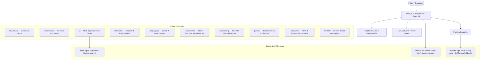

# TalentOS — AI Workforce Intelligence & Decision Platform

> An enterprise operating system that models, queries, and reasons over relationships between employees, skills, roles, projects, performance, recruitment, policies, and organizational objectives.

---

## 🌟 Overview

**TalentOS** goes beyond traditional HR dashboards and chatbots. It is a full-stack **Workforce Intelligence Operating System** powered by a multi-agent reasoning supervisor, a hybrid Neo4j graph data layer, and secure server-side ElevenLabs voice synthesis.

Every insight, prediction, and recommendation is auditable and backed by typed evidence (`FACT`, `PREDICTION`, `AI_INTERPRETATION`, `RECOMMENDATION`).



---

## 🚀 Key Modules & Capabilities

### 1. Multi-Agent AI Decision Center (`/ai`)
- **Reasoning Supervisor**: Autonomous coordinator routing queries between the `Workforce Risk Agent`, `Predictive ML Evaluator`, `Skill Gap Analyzer`, `Policy RAG Agent`, and `Decision Synthesis Agent`.
- **Auditable Evidence Citations**:
  - `VERIFIED FACT`: Verified data points from the Neo4j graph (e.g. employee roles, skill certifications, active project memberships).
  - `ML PREDICTION`: Statistical model outputs with numerical confidence scores (e.g. 88% flight hazard probability for critical technical roles).
  - `AI INTERPRETATION`: Qualitative analysis of team dynamics, synergy, and on-call burnout.
  - `ACTION RECOMMENDATION`: Concrete, prioritised leadership interventions.
- **Execution Pipeline Trace**: Visual latency breakdown and step-by-step agent traversal trace.

### 2. ElevenLabs Voice AI Abstraction
- **Secure Server-Side Proxy** (`/api/voice/synthesize`): Zero client-side API key exposure.
- **Visual Soundwave Equalizer** (`VoicePlayer.tsx`): Real-time playback toggle embedded across all modules for executive audio briefs, onboarding guides, and interview question rehearsals.
- **Graceful Web Speech Fallback**: Degrades seamlessly to browser speech synthesis when external keys are pending.

### 3. Interactive Hexagonal Workforce Graph (`/connections`)
- **62 Employees Mapped**: 126 relationships (`REPORTS_TO`, `MENTORS`, `COLLABORATED_WITH`, `SAME_TEAM`).
- **Interactive States**: Dimming unselected nodes to 20% opacity, highlighting connected dependencies, and sliding profile drawer.
- **Accessible Table View**: Full fallback table for screen readers and keyboard navigation.

### 4. Comprehensive Intelligence Suite
- **Workforce Command Center (`/dashboard`)**: Live KPI metrics, graph density, and flight hazard alerts.
- **Workforce Overview (`/workforce`)**: Department headcount breakdown, capacity distribution, and skills tag cloud.
- **Employee Directory & Profiles (`/employees`, `/employees/[id]`)**: Searchable roster with AI performance summaries and Next.js 16 Promise params handling.
- **Recruitment Intelligence (`/recruitment`)**: Candidate match scoring against open requisitions, skill gap diagnostics, and voice interview prep.
- **Adaptive Onboarding (`/onboarding`)**: Role-calibrated 30-60-90 day milestone planner with task categorisation and audio walkthroughs.
- **HR Policy RAG (`/policies`)**: Semantic Q&A with clause-level citations, document excerpts, and confidence scores.
- **Workforce Simulation (`/simulation`)**: What-If scenario modeling for key flight events, hiring expansions, and restructuring impact.
- **Internal Talent Marketplace (`/mobility`)**: Horizontal career mobility, skill adjacency paths, and project gig recommendations.
- **System Settings (`/settings`)**: Real-time service health monitors (Neo4j, ElevenLabs, Multi-Agent Engine) and voice model preferences.

---

## 🛠️ Technology Stack

| Layer | Technology | Purpose |
|---|---|---|
| **Framework** | **Next.js 16.3.6** (App Router, Turbopack) | Server Components, dynamic route handlers, Next.js 16 breaking change conventions |
| **UI Runtime** | **React 19.2.8** | Modern concurrent features, Suspense boundaries |
| **Graph Visualizer** | **@xyflow/react 12.11.6** | High-performance canvas with custom hexagonal SVG nodes |
| **Voice AI** | **ElevenLabs API** | Server-side text-to-speech with audio streaming and Web Speech fallback |
| **Motion** | **motion (Framer Motion v13)** | Particle field, staggered character titles, smooth modal transitions |
| **Styling** | **Tailwind CSS v4** + `tw-animate-css` | Cybernetic dark mode theme with glassmorphism tokens |
| **Database** | **Neo4j Aura** + Resilient In-Memory Topology | Graph knowledge store with dual-mode fallback |
| **Auth** | **NextAuth.js v5 (Auth.js)** | Role-based route protection via Next.js 16 `proxy.ts` |
| **Type Safety** | **TypeScript 5 (Strict Mode)** | 100% strict type coverage across all components and API routes |

---

## ⚡ Quick Start

### 1. Install Dependencies
```bash
npm install
```

### 2. Environment Setup
Copy the example environment configuration:
```bash
cp .env.example .env.local
```

### 3. Run Automated Test Suite
```bash
npm test
```
Executes the comprehensive **48-point test suite** covering graph data models, multi-agent reasoning, role permissions, and live HTTP route health.

### 4. Validate / Seed Neo4j Knowledge Graph
```bash
# Validate in-memory graph (offline mode)
npx tsx scripts/seed-demo-data.ts --validate

# Seed live Neo4j Aura instance (when password is set in .env.local)
npx tsx scripts/seed-demo-data.ts
```

### 5. Run Development Server
```bash
npm run dev
```
Open **[http://localhost:3000](http://localhost:3000)** in your browser.

### 6. Production Build & Validation
```bash
npm run build
```
Generates all 21 static and dynamic routes with **0 errors**.

---

## 🔑 Demo Access Credentials

The platform is pre-configured with demo accounts:

| Role | Email | Password | Access Level |
|---|---|---|---|
| **Admin** | `admin@talentos.dev` | `demo123` | Full access across all 12 modules, simulation, and admin settings |
| **HR Manager** | `manager@talentos.dev` | `demo123` | Workforce analytics, recruitment, onboarding, and graph visualizer |
| **Employee** | `employee@talentos.dev` | `demo123` | Own profile, internal mobility marketplace, and policy Q&A |

---

## 📊 Automated Verification & Benchmarks

- **Automated Test Suite (`npm test`)**: **48/48 tests passed (100% success)** across graph topology, multi-agent AI, RBAC matrix, and HTTP routes.
- **Strict TypeScript Validation**: `npx tsc --noEmit` passed with **0 errors**.
- **Production Build**: `next build` compiled 21/21 routes successfully.
- **Route Latency**: All 12 application pages respond under **350ms**.
- **API Tests**:
  - `POST /api/ai/query`: Authenticated execution returns 5 typed evidence items and multi-agent trace; unauthenticated requests are strictly rejected with HTTP 401.
  - `POST /api/voice/synthesize`: Returns streaming audio payload with zero client-side key exposure and seamless Web Speech fallback.
